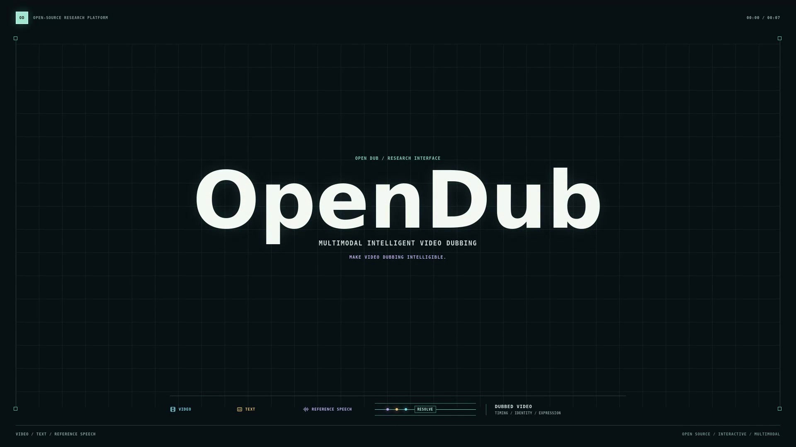
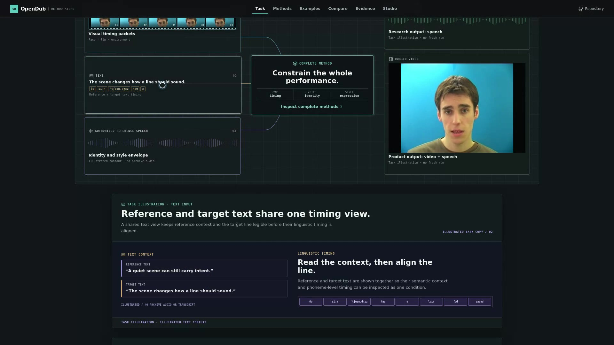
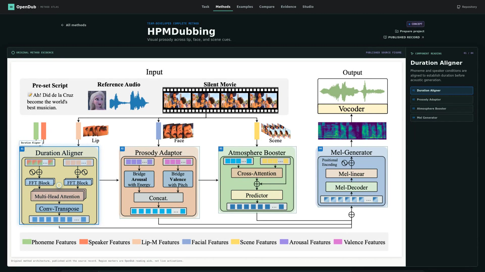
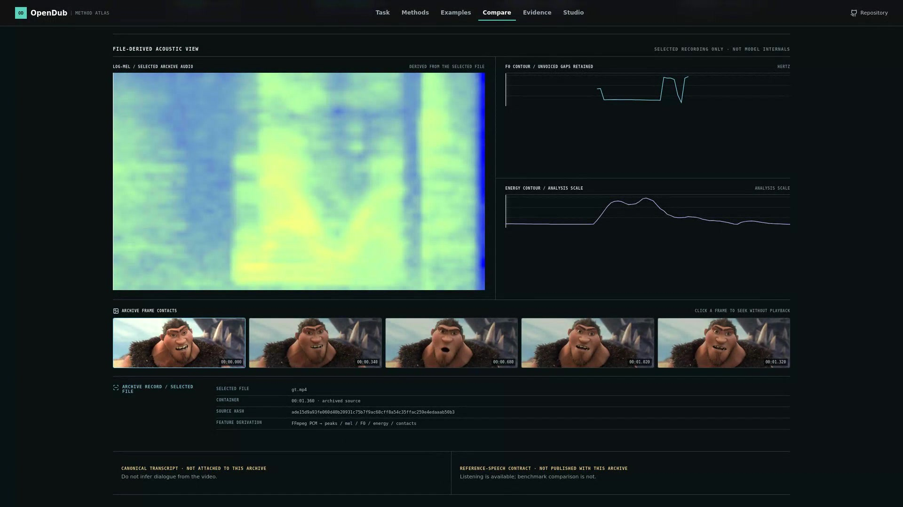
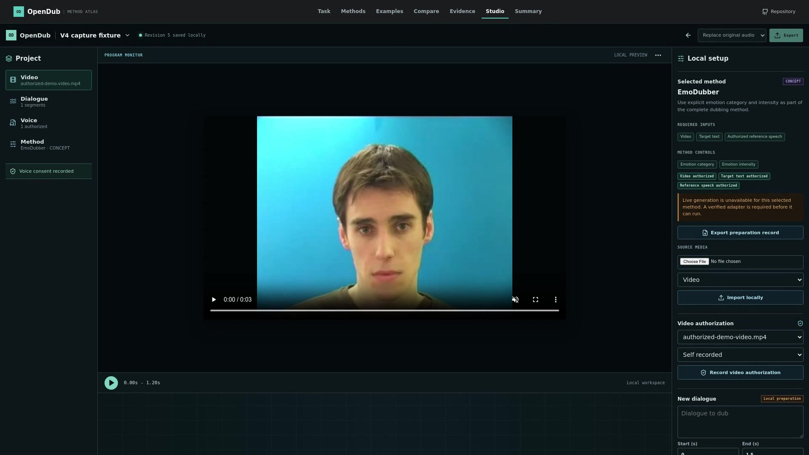
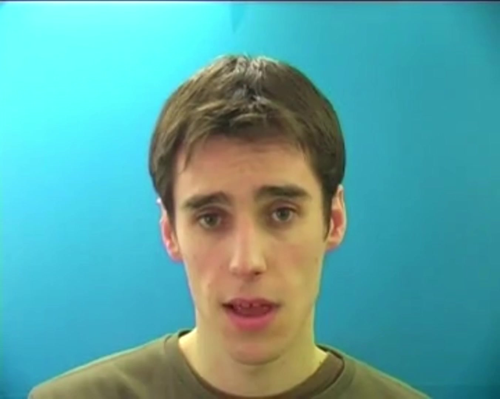
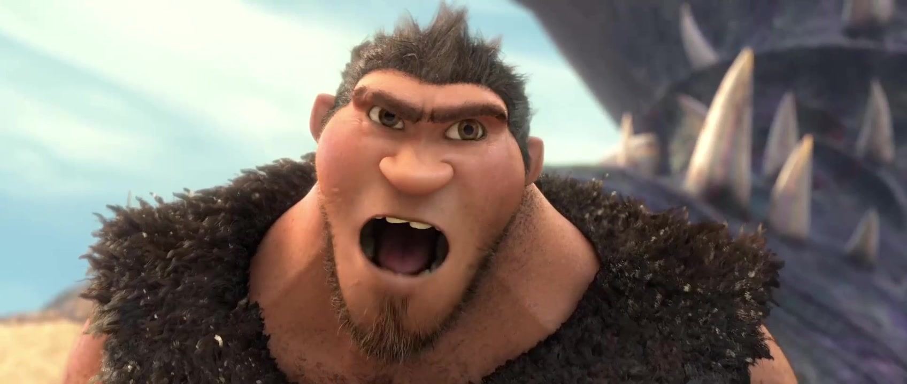
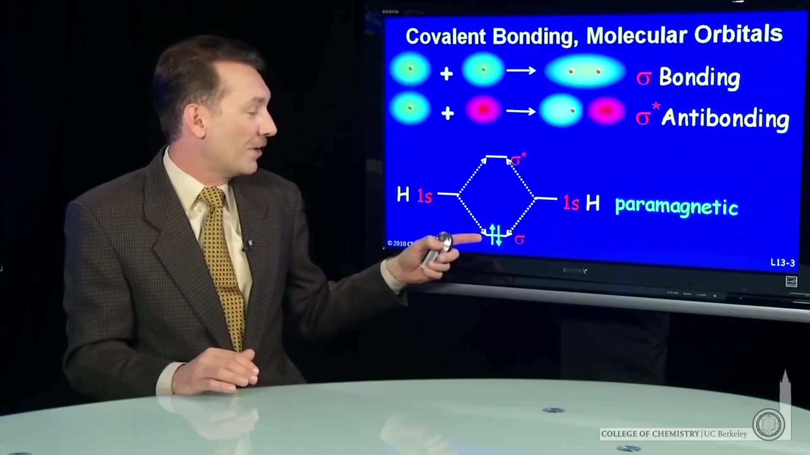

<div align="center">

# OpenDub

### An Open-Source Platform for Multimodal Intelligent Video Dubbing
### 多模态智能视频配音开源平台

**Make video dubbing understandable, inspectable, and reusable.**

[Project Film](docs/showcase/OpenDub_Project_Introduction_V4.6.mp4) · [Interactive Web App](apps/web) · [Methods](#team-developed-methods) · [Playable Examples](#listen-to-archived-examples) · [Documentation](docs/README.md)

</div>

[](docs/showcase/OpenDub_Project_Introduction_V4.6.mp4)

<div align="center">

**[Watch the OpenDub project introduction](docs/showcase/OpenDub_Project_Introduction_V4.6.mp4)**

`4 min 37 s` · `1920 x 1080` · `Chinese / English subtitles` · [delivery details](docs/showcase/README.md)

</div>

OpenDub is a local-first research platform for **multimodal video dubbing**. It
turns a difficult research task into a clear, interactive experience: explain
the inputs, inspect complete methods developed by the team, listen to authorized
archived examples, relate hearing to observable acoustic evidence, and prepare a
rights-aware local project.

> OpenDub does **not** splice internal modules from different papers into a new,
> unverified model. HPMDubbing, StyleDubber, and EmoDubber remain independent,
> complete methods. OpenDub makes their task assumptions, evidence, and usage
> boundaries visible in one place.

## The Task

```text
Silent Video + Text + Authorized Reference Speech
                         │
                         ▼
                 One complete dubbing method
                         │
                         ▼
         Target Dubbed Speech + Dubbed Video
```

Video dubbing is more than reading a sentence aloud. The video carries lip
motion, facial expression, scene context, and timing; text defines the intended
content; authorized reference speech supplies an identity and style condition.
OpenDub exposes these signals as an interactive, time-aware task rather than a
black-box audio button.

## What You Can Explore

| Task Stage | Method Atlas |
| --- | --- |
|  |  |
| Start with the synchronized roles of video, text, and reference speech. Inspect face, lip, environment, phoneme, prosody, and output views. | Explore each complete team-developed method through its original architecture, clickable components, and source record. |

| Compare Workbench | Evidence and Studio |
| --- | --- |
|  |  |
| Relate archived video and audio to waveform, log-mel, F0, energy, and frame contacts in one synchronized record. | Trace evidence, select a complete method, record authorized inputs, and export a versioned local preparation record. |

## Listen To Archived Examples

The following clips are **authorized, team-provided historical research
examples**. Select a method name to open its MP4 in GitHub's video viewer; run
the local web app to inspect the same assets with synchronized playback and
acoustic features. These are not fresh OpenDub runs, common-input replay, or
rankings.

### Example Gallery

| Human portrait case · 3.0 s | Animated character case · 1.36 s |
| --- | --- |
| [](apps/web/public/showcases/v2/human-0/emodubber.mp4) | [](apps/web/public/showcases/v2/animation-1/emodubber.mp4) |
| [Reference performance](apps/web/public/showcases/v2/human-0/gt.mp4) · [HPMDubbing](apps/web/public/showcases/v2/human-0/hpmdubbing.mp4) · [StyleDubber](apps/web/public/showcases/v2/human-0/styledubber.mp4) · [EmoDubber](apps/web/public/showcases/v2/human-0/emodubber.mp4) | [Reference performance](apps/web/public/showcases/v2/animation-1/gt.mp4) · [HPMDubbing](apps/web/public/showcases/v2/animation-1/hpmdubbing.mp4) · [StyleDubber](apps/web/public/showcases/v2/animation-1/styledubber.mp4) · [EmoDubber](apps/web/public/showcases/v2/animation-1/emodubber.mp4) |
| [Case record](apps/web/content/showcases/v2/human-0.json) · [authorization record](docs/rights/showcase-media-rights-v2.md) | [Case record](apps/web/content/showcases/v2/animation-1.json) · [authorization record](docs/rights/showcase-media-rights-v2.md) |

### Comparison Workbench

| Animated cinematic scene · 1.56 s | Presenter and display scene · 7.8 s |
| --- | --- |
| [](apps/web/public/showcases/v3/case-03/emodubber.mp4) | [](apps/web/public/showcases/v4/case-04/styledubber.mp4) |
| [Reference performance](apps/web/public/showcases/v3/case-03/gt.mp4) · [HPMDubbing](apps/web/public/showcases/v3/case-03/hpmdubbing.mp4) · [StyleDubber](apps/web/public/showcases/v3/case-03/styledubber.mp4) · [EmoDubber](apps/web/public/showcases/v3/case-03/emodubber.mp4) | [Reference performance](apps/web/public/showcases/v4/case-04/gt.mp4) · [HPMDubbing](apps/web/public/showcases/v4/case-04/hpmdubbing.mp4) · [StyleDubber](apps/web/public/showcases/v4/case-04/styledubber.mp4) · [EmoDubber](apps/web/public/showcases/v4/case-04/emodubber.mp4) |
| [Case record](apps/web/content/showcases/v3/case-03.json) · [authorization record](docs/rights/showcase-media-rights-v3.md) | [Case record](apps/web/content/showcases/v4/case-04.json) · [authorization record](docs/rights/showcase-media-rights-v4.md) |

**Archived research example — not a fresh OpenDub run or a common-input ranking.**

## Team-Developed Methods

OpenDub presents the team's original work as complete methods with distinct
priorities, rather than treating them as interchangeable fragments.

| Method | Complete-method focus | Upstream source |
| --- | --- | --- |
| **HPMDubbing** | Hierarchical visual prosody: lip motion, facial affect, and scene context guide duration, pitch, energy, and emotion. | [Repository](https://github.com/GalaxyCong/HPMDubbing) · [paper](https://openaccess.thecvf.com/content/CVPR2023/html/Cong_Learning_To_Dub_Movies_via_Hierarchical_Prosody_Models_CVPR_2023_paper.html) |
| **StyleDubber** | Multi-scale style learning: visual frames, phonemes, and utterance-level context support clear pronunciation and character style. | [Repository](https://github.com/GalaxyCong/StyleDubber) |
| **EmoDubber** | Emotion-controllable movie dubbing: lip-related alignment, pronunciation, speaker identity, and emotion-guided generation. | [Repository](https://github.com/GalaxyCong/EmoDubber) · [paper](https://openaccess.thecvf.com/content/CVPR2025/html/Cong_EmoDubber_Towards_High_Quality_and_Emotion_Controllable_Movie_Dubbing_CVPR_2025_paper.html) |
| **InstructDubber** | Instruction-based Alignment for Zero-shot Movie Dubbing. | [Repository](https://github.com/ZZDoog/InstructDubber) · [paper](https://ojs.aaai.org/index.php/AAAI/article/view/38298) |

## Public Scope

| Available now | Evidence-gated by design |
| --- | --- |
| Interactive task explanation, method canvases, original-paper component views, local Studio preparation, evidence records, and authorized archived examples. | Fresh model execution, numerical comparison, replay, and live generation require a verified method runtime, licensed weights, authorized inputs, and a real smoke test. |

This distinction is deliberate. It prevents mechanism illustrations or historical
media from being misrepresented as a new inference result. See the
[project overview](docs/PROJECT_OVERVIEW.md) and [model admission policy](docs/adapters/research-backend-gate.md).

## Run Locally

The interactive experience runs entirely on your machine.

```bash
pnpm install
pnpm web:dev
```

Open `http://127.0.0.1:5173` and visit **Task**, **Methods**, **Examples**,
**Compare**, **Evidence**, and **Studio**. The Studio/API workflow is also
available through the local compose stack:

```bash
docker compose up --build
```

For the full quality gate:

```bash
make check
```

## Documentation

- [Public project overview](docs/PROJECT_OVERVIEW.md)
- [Project film, subtitles, and checksum](docs/showcase/README.md)
- [Documentation index](docs/README.md)
- [Platform architecture](docs/architecture/README.md)
- [Method admission status](docs/adapters/model-status.md)
- [Example-media rights records](docs/rights/)
- [Contribution guide](CONTRIBUTING.md)

## Responsible Use

Use only video, text, and reference speech that you own or are authorized to
process. Do not impersonate people, misrepresent generated media, or redistribute
restricted source material. OpenDub is designed for local-first workflows and
keeps evidence, input authorization, and runtime admission explicit.

## License and Citation

New OpenDub platform code is released under [Apache-2.0](LICENSE). Upstream
methods, model weights, datasets, and example media remain subject to their own
licenses and permission records. See [NOTICE](NOTICE) and [CITATION.cff](CITATION.cff).
