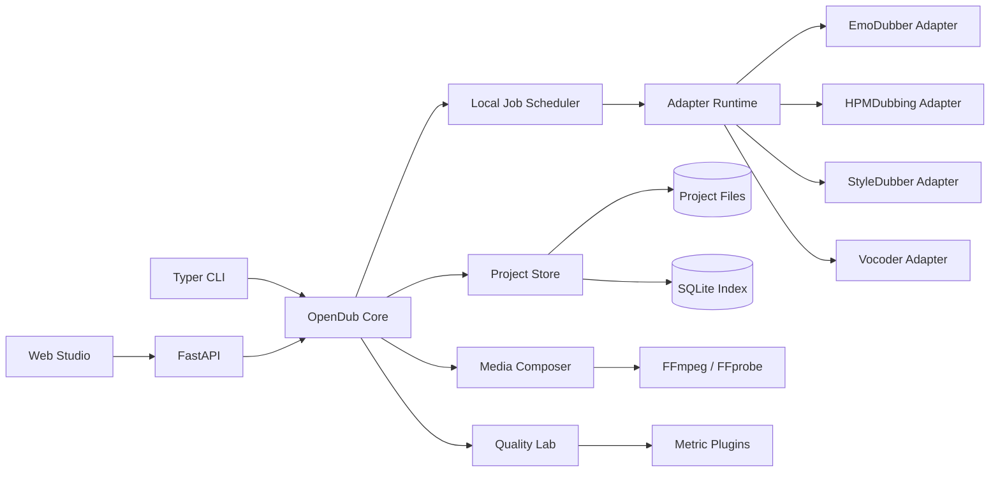
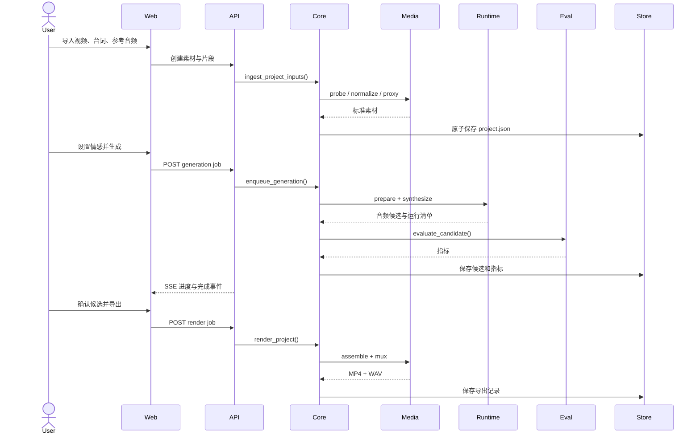

# System Architecture

## 总体结构

OpenDub 采用本地优先的模块化单体架构：一个核心 Python 包定义领域和流水线，一个 FastAPI 服务提供本地 API，一个 React Web Studio 提供专业工作台，模型通过隔离的 Adapter Runtime 运行。首版不引入微服务、Kubernetes 或云端依赖。

## 架构决策

### 本地优先

- API 默认绑定 `127.0.0.1`。
- 用户视频、声音、台词和输出默认不离开本机。
- 所有联网行为显式发生：下载模型、检查更新或打开外部文档。
- 远程多人服务不属于 `v0.1.0`。

### 模块化单体

- 核心领域与流水线在同一 Python 发行包中，降低安装和调试复杂度。
- 模型进程可以隔离，以处理 Python/CUDA/依赖冲突。
- 未来可以替换任务调度器或远程模型执行器，但首版不提前建设分布式系统。

### 文件为真相源

- `project.json` 是项目内容的唯一真相源。
- SQLite 只用于快速索引项目、任务和事件；丢失 SQLite 后可从项目目录重建。
- 生成物不写入数据库 BLOB。

### 能力驱动

- 前端请求 `ModelCapabilities` 决定可以展示哪些控制。
- Pipeline 选择满足需求的 Adapter，不直接导入模型仓库内部代码。
- 适配器输出标准化 `AudioArtifact` 和 `GenerationManifest`。

## 组件边界

### Domain

职责：

- 定义项目、素材、片段、角色、声音引用、生成请求、候选、指标和状态。
- 校验状态转换与不变量。
- 不依赖 FastAPI、数据库、FFmpeg、PyTorch 或前端。

### Project Store

职责：

- 原子读写项目清单；
- 组织项目工作目录；
- 计算和验证素材哈希；
- 管理候选、报告和导出引用；
- 重建 SQLite 索引。

必须使用写临时文件后原子替换的方式保存 `project.json`，避免进程中断造成损坏。

### Media Composer

职责：

- 封装 FFprobe/FFmpeg 命令；
- 生成代理视频、音轨、封面和片段；
- 对参考声音执行单声道化、重采样、静音和削波检查；
- 拼接候选并进行响度处理；
- 混流输出视频。

Media Composer 只负责确定性媒体转换，不实现神经模型。

### Adapter Runtime

职责：

- 发现适配器；
- 验证环境和权重；
- 将标准请求转换为模型输入；
- 在隔离进程中运行；
- 上报结构化进度与错误；
- 收集标准化输出。

适配器实现不得直接修改项目状态，只能返回输出和事件。

### Pipeline Orchestrator

职责：

- 生成任务计划；
- 复用已验证的中间产物；
- 控制状态转换；
- 响应取消；
- 将生成、评测和渲染结果持久化。

### Quality Lab

职责：

- 运行指标插件；
- 区分 `value`、`not_applicable`、`unavailable` 和 `failed`；
- 汇总片段级与项目级结果；
- 生成 JSON、CSV 和 HTML/Markdown 报告。

### Local Job Scheduler

职责：

- 单机队列；
- 每个 GPU 默认同时运行一个生成任务；
- CPU 预处理允许有限并发；
- 持久化任务状态和事件；
- 进程重启后将运行中任务标记为 `interrupted`，允许恢复。

首版不需要 Redis。调度器通过 `JobBackend` 协议保留替换点。

### FastAPI

职责：

- 对项目、素材、片段、任务、候选、指标和导出提供 REST API；
- 使用 SSE 推送任务事件；
- 提供 OpenAPI 文档；
- 将领域错误映射为稳定错误码。

API 不包含模型业务逻辑。

### Web Studio

职责：

- 项目与素材管理；
- 视频播放器和时间线；
- 片段编辑与模型能力展示；
- 任务队列与候选比较；
- 评测报告和导出。

前端不直接访问项目文件系统，也不自行拼接 FFmpeg 命令。

## 核心数据流

## 运行模式

### 原生开发模式

- Python 使用 `uv` 管理；
- Web 使用 `pnpm`；
- API 和 Web 分别启动；
- 模型适配器可以使用独立 `uv` 环境或 Conda 环境。

### Docker GPU 模式

- `opendub-api`：核心、API、FFmpeg；
- `opendub-web`：静态 Web；
- `opendub-worker`：CUDA、PyTorch、适配器；
- 本地卷：项目、模型缓存、日志；
- 仅 worker 请求 GPU。

### CLI 批处理模式

CLI 直接调用 Core，不要求启动 HTTP 服务。需要 GPU 的任务仍通过相同 Adapter Runtime 执行，因此 Web 与 CLI 结果结构一致。

## 缓存策略

缓存键由以下内容共同决定：

- 输入素材 SHA-256；
- 片段时间窗与文本；
- 参考音频 SHA-256；
- 情感/风格/时长配置；
- 适配器版本；
- 权重 SHA-256；
- 预处理器版本；
- 随机种子。

任一项变化即创建新缓存键。用户确认候选不会改变候选本身，只更新项目引用。

## 故障边界

- FFmpeg 失败：保存命令、退出码和截断后的 stderr。
- 模型环境失败：区分依赖缺失、权重缺失、显存不足、输入不兼容和模型内部错误。
- 指标失败：不丢弃生成候选，报告单项指标失败。
- Web 断开：任务继续运行，重连后通过事件序号补齐状态。
- 进程中断：保留完整中间产物，未完成文件使用 `.partial` 后缀，不进入项目清单。

## 性能策略

- 视频代理与特征按素材缓存；
- 相同角色参考音频的 embedding 按哈希缓存；
- 多片段生成按模型分组，减少模型装载次数；
- worker 在空闲超时后释放模型显存；
- Web 只读取代理视频和降采样波形，不直接加载原始大文件；
- 长任务按阶段上报进度，不伪造线性百分比。
