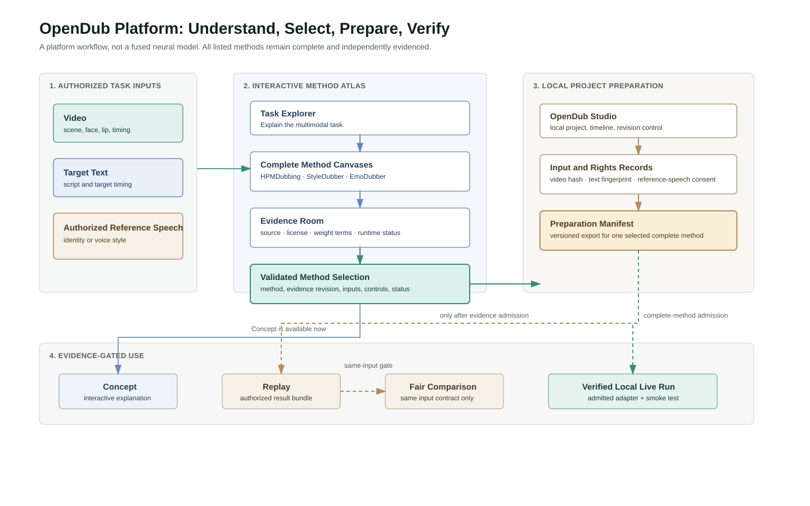

# OpenDub Platform Architecture

This figure records the application-release product boundary:

1. **Authorized task inputs** define the multimodal dubbing task: video, target text, and authorized reference speech.
2. **Interactive Method Atlas** explains the task, presents each complete research method intact, exposes its evidence, and produces a validated selection record.
3. **OpenDub Studio** turns that selection into a local project with rights records and a versioned preparation manifest.
4. **Replay, fair comparison, and Live runs are conditional.** They remain unavailable until their respective evidence gates are met.

The figure deliberately does not depict a unified neural pipeline. HPMDubbing, StyleDubber, and EmoDubber remain independent complete methods rather than interchangeable internal modules.

Files:

- `opendub-platform-architecture.drawio`: editable source for draw.io / diagrams.net;
- `opendub-platform-architecture.svg`: vector asset for the README, Word form, slides, or recording overlays.
